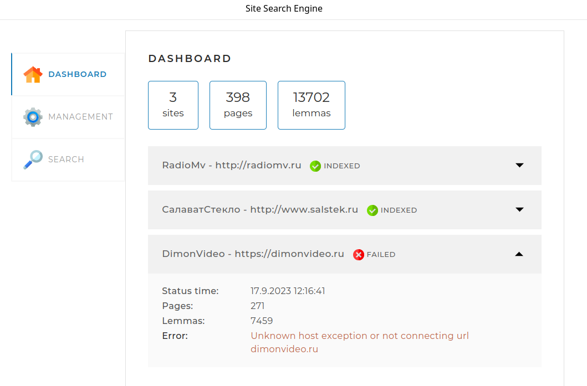
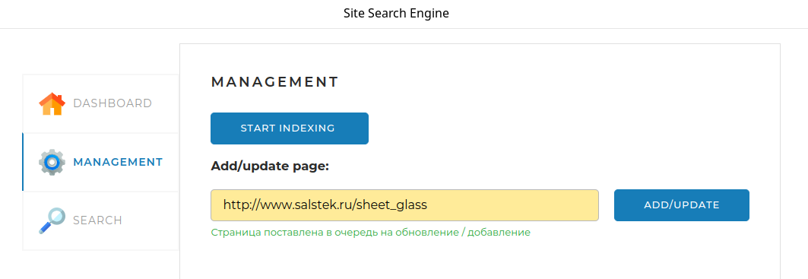
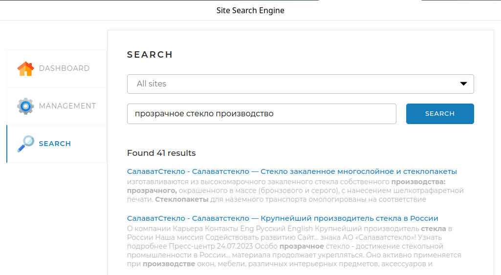

## Search Engine

### Итоговый проект курса «Java-разработчик с нуля» от компании Skillbox «Поисковый движок»

Этот проект представляет собой поисковой движок, который обладает следующими основными составляющими:
<li> система обхода веб-страниц;</li>
<li> система индексации найденных веб-страниц;</li>
<li> системы поиска по проиндексированным страницам.</li>

### Системные требования:

<li> Java 19 или выше </li>
<li> Maven 3.8 или выше</li>
<li> MySql 8 или выше</li>

### Использованные технологии:

<li> Spring</li>
<li> JSOUP</li>
<li> Russian Morphology for Apache Lucene</li>
<li> Maven</li>

### Описание веб-интерфейса
Интерфейс представляет собой одну веб-страницу, с тремя вкладками.

<li> Dashbord. Эта вкладка открывается по умолчанию. На ней отображается 
статистика, получаемая по запросу /api/statistics.</li>


<li>Management.  На этой вкладке находятся инструменты управления поисковым движком — запуск и остановка полной
индексации (переиндексации), а также возможность добавить (обновить) отдельную страницу по ссылке:</li>

<li>Search. Эта вкладка предназначена для тестирования поискового движка. 
Результаты выводятся по API запросу /api/search:</li>



### Запуск и сборка проекта:

1. Установить СУБД MySql.
2. В базе данных создать схему search_engine, установить _collation: utf8mb4_unicode_ci и characterset: utf8mb4.
2. Изменить, если надо, имя и пароль пользователя СУБД MySQL в конфигурационном файле _application.yaml_.
3. Проверить наличие установленного фреймворка Apache Maven, если его нет то установить.
4. В командной оболочке(терминале ) перейти в корневую папку проекта и 
выполнить команду для компиляции:
```shell
   mvn —U clear package
   ```
   Результат компиляции,_SearchEngine-1.0-SNAPSHOT.jar_, будет располагаться в папке target. Этот файл можно перенести 
   в любую   доступную папку на компьютере, при этом в той же папке должны находиться файл конфигурации _application.yaml_.
5. Приложение запускается строкой:
```shell
   java -jar SearchEngine-0.0.1-SNAPSHOT.jar.
```
